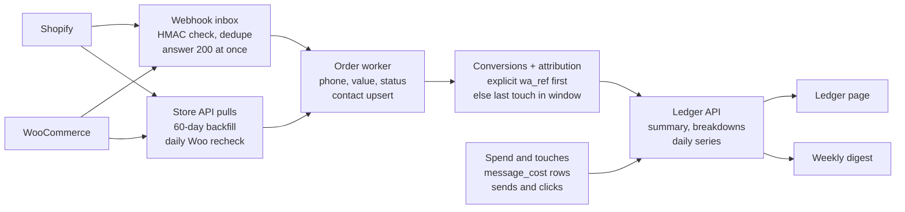
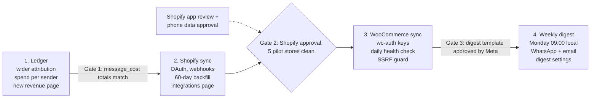

# Revenue Ledger, Store Sync & Business Plan

> Working copy of the plan. Update this file as decisions change. Started from the Claude Doc
> (https://claude.ai/code/artifact/02310aa3-eca3-45a6-b560-b8b00cd7088e, rev 28, 2026-09-30),
> which is no longer kept in sync.

2026-09-27 · @Dhiraj

## Status

Where the code stands against this plan. Update this section as work lands.

Last checked 2026-09-30 against `main` in both repos (backend-wb `ba473ad`, frontend-DA `69269bd`).

### Billing model, order of work

| # | Step | Status |
| --- | --- | --- |
| 1 | `message_cost`, spend from it, markup and wallet retired, Meta cost view | **Not started.** Markup still charged (`resolveMarkupPercent`); wallet, top-ups, partner mode and the campaign balance check are live. Service messages are skipped (`backend-wb/src/billing/billing.service.ts:256`). Ledger spend reads `wallet_entry.amountMicros`, which for customer-billed accounts is only the markup, so return on spend is overstated. |
| 2 | Phase 3: WooCommerce sync | **Not started.** Only the `woocommerce` enum values and `store_connection.platform` exist. |
| 3 | Proof type, influenced vs proven, 10% holdout | **Partial.** Conversions store `attributionModel` (`explicit` from `wa_ref` or a caller's campaignId, `last_touch`, `unattributed`) and `touchAt`. Missing: click vs send as proof, coupon proof, paid-in-WhatsApp proof, both figures on the page, the holdout. |
| 4 | Phase 4: weekly digest | **Not started.** No digest_log, account timezone or owner phone OTP. Needs the platform phone number id and template names. |
| 5 | Shadow billing for pilot brands | **Not started.** |
| 6 | COD and cart closer, own-invoice reminders, creator and coach plan | **Not started.** A `src/calls` module exists; its fitness for the COD closer is unchecked. |

### Business strategy action plan

| Stage | Status |
| --- | --- |
| This week: service cost in the Meta cost view; path for contacts with a username and no phone | **Neither done.** Contacts are keyed on `waId`. |
| Months 0–3: free tier, shadow billing on Shopify brands, COD closer, Conversions API tier, Marketing Messages API | Shopify sync (the pilot's data source) is live on QA. Go-live still needs: rotate the leaked client secret, deploy `shopify.app.toml`, protected customer data approval, unset `SHOPIFY_INCLUDE_TEST_ORDERS`. Everything else not started. |
| Gate: pilot brands find the shadow bill fair | Not reached. |
| Months 3–6, months 6–12, year 2 | Not started. |
| Bill-checker page (positioning) | Not started. |

### Built and live (QA)

- Phase 1 ledger: headline row, daily chart, breakdowns by source, sender and customer, attribution window setting (1/7/14/30). By-template and by-segment breakdowns are not built.
- Attribution across campaigns, drips, flows, automations and inbox replies (inbox on by default, per-account switch, deployed 2026-09-30).
- `wa_ref` and UTM on tracked-link redirects, read back from Shopify orders (`backend-wb/src/links/attribution-params.ts`).
- Phase 2 Shopify sync: OAuth, webhooks, 60-day backfill, order worker, Store sync page; order #1003 synced end to end on the dev store.
- Consent record and consent export.

### Next

1. Bug fixes (current focus).
2. Billing model step 1.
3. Username-only contacts path.
4. Then the order of work above.

## Goal

Show every store owner, every week, how many rupees each rupee of WhatsApp spend brought back, with orders pulled automatically from Shopify and WooCommerce. Today attribution exists but conversions only arrive through the API or manual entry, so almost no small business ever sees a revenue number.

Why it builds dependence: once the owner's weekly revenue report lives here, leaving means losing that history and the proof of what works.

Success, measured 60 days after launch:

- 40% of active accounts connect a store
- 70% of connected accounts open the ledger or the weekly digest at least once a week
- Churn of store-connected accounts is half that of unconnected ones

These targets are proposals to confirm, not measured baselines.

## What exists today

The revenue plumbing is solid. What's missing is a way for orders to arrive without the customer writing code, and a view that puts spend next to revenue.

| Piece | Where | State |
| --- | --- | --- |
| Conversion record | `backend-wb/src/conversions/conversion.entity.ts` | Money in bigint micros, idempotent on `(accountId, externalId)`, void instead of delete, `occurredAt` = sale time |
| Attribution | `conversions.service.ts` `resolveAttribution` | Last touch (click beats send) inside `CONVERSION_ATTRIBUTION_WINDOW_DAYS` (default 7), or explicit `campaignId`. Campaigns only |
| Order intake | `POST /conversions` (`ApiKeyOrJwtGuard`) | API key or manual entry from the dashboard. No store connectors |
| Tracked links | `src/links/`, `CampaignRecipient.clickedAt` | Clicks recorded per recipient |
| Spend | `WalletEntry` | Per-message debit keyed by `waMessageId`, with `source` (campaign, drip, automation, flow, manual, system). No `campaignId` column |
| Revenue page | `app/dashboard/revenue/page.tsx` | Lists reported sales, record/void. Hand-rolled `useState` + fetch, no spend comparison |
| Background work | `setInterval` dispatchers + `common/advisory-lock.ts`, `FOR UPDATE SKIP LOCKED` inbox in `webhook/` | Pattern to reuse for store webhooks and backfill |

Gaps this spec closes:

- No Shopify or WooCommerce connector.
- Drip, flow and automation messages cost money but can never earn credit, because attribution only looks at `CampaignRecipient`.
- Spend per campaign needs a join from `WalletEntry.waMessageId` to `CampaignRecipient.waMessageId`, and nothing computes it yet.
- No return-on-spend figure anywhere, and no weekly summary sent to the owner.
- Currency: a conversion in a currency other than the account's `billingCurrency` is refused. Store orders in another currency need a rule (see open questions).

## The ledger

One page answers "what did WhatsApp cost me and what did it bring back", for any date range, down to the campaign, drip, flow, template and contact. It replaces the current revenue page at `/dashboard/revenue`.

### Headline row (selected range vs previous range)

- **Spend**: what Meta billed the customer for the messages in the range, from the per-message cost record (`message_cost`), in billingCurrency including GST. Customers pay Meta directly; there is no wallet or markup (decided 2026-09-30).
- **Attributed revenue**: non-voided conversions with a credited source.
- **Return on spend**: attributed revenue ÷ spend, shown as "₹14 back per ₹1".
- **Attributed orders** and **average order value**.
- **Unattributed revenue**: store orders we received but could not tie to a message. Shown, not hidden, so the total matches the store's own report.

### Breakdowns

| Tab | Rows | Columns |
| --- | --- | --- |
| By source | Campaigns, drips, flows, automations, inbox (manual) | Spend, messages, orders, revenue, return |
| By campaign | Each campaign | Same, plus sent, read, clicked, time from message to order (median) |
| By template | Each template name | Same, summed across every sender |
| By segment | Segment the campaign targeted | Same |
| Customers | Contacts with revenue | Lifetime revenue, WhatsApp spend on them, last order, last touch |

A daily chart of spend and attributed revenue sits above the tabs. The customer row links to the contact's activity and chat.

### Attribution rules

1. **Explicit wins.** A `campaignId` from the caller, or a `wa_ref` parameter found on the order's landing URL, credits that sender outright.
2. **Otherwise last touch** within the account's window. A click beats a send. This is the current rule, widened from campaign sends to every marketing send (drip, flow, automation).
3. **The window becomes an account setting**: 1, 7, 14 or 30 days, default 7. The window used is stored on each conversion so changing it never restates past revenue.
4. **Refunds and cancellations void** the conversion. Partial refunds reduce its value through a void plus a replacement row (see backend plan).
5. **Inbox (manual) messages** earn credit by default: an agent-closed sale is credited to "inbox". An account can turn this off. Decided 2026-09-28.

Tracked links gain a `wa_ref` query parameter (`<source>:<id>`, e.g. `campaign:9f1…`) on redirect. The redirect also sets `utm_source=whatsapp` and copies the ref into `utm_content`. Shopify keeps the landing URL on the order and WooCommerce records UTM values, so most store orders get explicit attribution, not a guess.

### Weekly digest

Every Monday at 09:00 in the account's timezone, the owner gets a WhatsApp message and an email:

> Last week: ₹3,200 spent on WhatsApp, ₹41,000 in orders came from it (₹12.8 per ₹1). Best: "Diwali restock" campaign, ₹18,400. Open the ledger →

- Sent from the platform's own WhatsApp number as a utility template, so it never costs the customer anything.
- Recipient is the account owner only (decided 2026-09-28): one WhatsApp number, entered and changed only by the owner, confirmed with a one-time code from the platform number, which also records the opt-in. Offered on the Revenue page and once after a store connects. Email goes to the owner's login email by default and can be turned off.
- No digest when there was no spend and no revenue that week.

## Shopify sync

A public Shopify app, installed by OAuth from our dashboard. It turns every order into a conversion within seconds and backfills the last 60 days on connect. Shopify platform details below are from memory, not checked against Shopify's docs for this draft. Verify them before the build starts.

### Connect

1. Owner enters their `*.myshopify.com` domain on `/dashboard/integrations` and clicks Connect.
2. Backend redirects to Shopify's authorize URL with scopes `read_orders`, `read_customers` and a signed `state`.
3. Shopify calls back to the backend. It verifies the HMAC and `state`, exchanges the code for an offline access token, and stores the token encrypted (same AES-256-GCM helper as `account.accessToken`).
4. Backend reads the shop's currency and refuses the connection if it differs from the account's billing currency. Otherwise it registers webhooks, starts the backfill, and redirects to the dashboard with the store shown as "Syncing".

### Webhooks

| Topic | Action |
| --- | --- |
| `orders/create` | Record conversion (idempotent on `shopify:<order id>`) |
| `orders/updated` | Re-sync value; void if cancelled |
| `orders/cancelled` | Void, reason "cancelled" |
| `refunds/create` | Void and replace with the net value, or void outright on a full refund |
| `app/uninstalled` | Mark store disconnected, stop sync, keep past conversions |
| `customers/data_request`, `customers/redact`, `shop/redact` | Mandatory privacy webhooks: export or erase that customer's store data |

Every webhook is verified with `X-Shopify-Hmac-Sha256` over the raw body, deduplicated on `X-Shopify-Webhook-Id`, written to an inbox table and answered 200 at once. A worker processes the inbox, the same way the Meta webhook inbox works today.

### Order to conversion

- **Phone**: first of order phone, customer phone, shipping address phone, billing address phone. Normalised to `wa_id` using the address country. An order with no usable phone is stored as unattributed revenue.
- **Value**: current total in shop currency (`shopMoney`), which already nets out refunds. Cash-on-delivery orders count when placed, although unpaid, and are voided on cancellation or return.
- **Occurred at**: the order's `created_at`.
- **Explicit attribution**: `wa_ref` read from the order's landing URL.
- **Contact**: created or updated with tags `shopify`, `customer`, and order count and last order date as attributes. Marketing opt-in is **not** set from an order. Only the store's own marketing consent flag may set it.

### Backfill

60 days of orders through the GraphQL Admin API bulk operation, run once on connect. Older orders need the `read_all_orders` scope, which Shopify grants on request, so it's out of scope for v1. Backfilled orders go through the same attribution, so historic campaigns get credit too.

### Approval risks

- A public app must pass Shopify's app review before merchants can install it outside development stores.
- Customer phone numbers are protected customer data. The app needs Shopify's approval for that access, and without it phone fields come back empty. Apply on day one; it gates the whole feature.

## WooCommerce sync

No app store and no review: the owner approves a REST key from their own WordPress admin, and we register webhooks with it. Every store is self-hosted, so the hard part is unreliable hosts, not the API. As with Shopify, verify these platform details against WooCommerce's docs before building.

### Connect

1. Owner enters their store URL (HTTPS required) and clicks Connect.
2. Backend sends them to the store's `/wc-auth/v1/authorize` with `scope=read`, a `return_url` to the dashboard and a `callback_url` on the backend carrying a signed, single-use `user_id` token.
3. The owner approves in WordPress. WooCommerce POSTs the consumer key and secret to our callback. We store both encrypted.
4. Backend checks the key with `GET /wp-json/wc/v3/system_status`, which also gives currency, timezone and WooCommerce version. A store whose currency differs from the account's billing currency is refused here. It then creates webhooks and starts the backfill.

Fallback when the authorize page is blocked (security plugin, or a WordPress setup without pretty permalinks): the owner pastes a manually created read-only key.

### Webhooks

Created through `POST /wp-json/wc/v3/webhooks`, each with its own random secret, for `order.created`, `order.updated`, `order.deleted` and `order.restored`.

- Verified with `X-WC-Webhook-Signature` (base64 HMAC-SHA256 of the raw body), then the same inbox and worker as Shopify.
- **WooCommerce disables a webhook after repeated delivery failures.** A daily health check lists our webhooks, re-enables or recreates any that are off, and pulls orders modified since the last good sync. Missed orders are recovered, not lost.

### Order to conversion

- **Phone**: `billing.phone`, then `shipping.phone`, normalised with the billing country.
- **Value**: order `total` minus the sum of `refunds`, in the order currency.
- **Status mapping**: `processing` and `completed` count. `pending` and `on-hold` wait. `cancelled`, `failed` and `refunded` void.
- **Explicit attribution**: WooCommerce 8.5 and later records UTM parameters on the order (order attribution meta). Our tracked-link redirect adds `utm_source=whatsapp` and puts the `wa_ref` in `utm_content`, so it survives into the order.
- **Contact**: same rules as Shopify. Tag `woocommerce`, never opted in from an order alone.

### Backfill

`GET /wp-json/wc/v3/orders?after=<60 days ago>&per_page=100`, paged, throttled to one request a second, because shared hosting falls over under load.

### Later: our own WordPress plugin

Not in v1. It would add a WhatsApp opt-in checkbox at checkout, abandoned-cart capture, and a way to reach sites whose REST API is blocked.

## Backend plan (backend-wb)

A new `src/integrations/` module owns store connections and order intake, and a new `src/ledger/` module owns the read side. Both feed the existing `ConversionsService.record()`, so idempotency, void rules and micros money stay in one place.

*Store sync data flow (backend-wb). Spend source updated from WalletEntry to message_cost on 2026-09-30.*

Webhooks and API pulls both land in the order worker, so a missed webhook recovered by the daily recheck goes through exactly the same code as a live one.

### Data model

| Table | Change | Key columns |
| --- | --- | --- |
| `store_connection` | New | `accountId`, `platform` (shopify, woocommerce), `storeDomain` unique per platform, encrypted `credentials`, `currency`, `timezone`, `status` (syncing, connected, error, disconnected), `lastSyncedAt`, `lastError`, `backfillCursor` |
| `store_webhook_event` | New inbox | `connectionId`, `topic`, `externalEventId` (unique per connection), `payload` jsonb, `attempts`, `leaseUntil`, `processedAt`, `lastError` |
| `conversion` | Add columns | `connectionId`, `orderRef` (`shopify:<id>`, not unique), `sourceType` (campaign, drip, flow, automation, inbox), `sourceRefId`, `attributionWindowDays`. `source` gains `shopify` and `woocommerce`. `campaignId` kept and still filled for campaigns |
| `whatsapp_event`, `wallet_entry` | Add column | `sourceRefId`, stamped at send time next to the existing `source`, so a drip or flow send is both a touch and a cost |
| `tracked_link`, `link_click` | Add columns | `sourceType`, `sourceRefId`, so drips and flows can track clicks too |
| `account` | Add columns | `attributionWindowDays` (default 7), `timezone`, `digestEmail`, `digestWhatsappOptIn` |
| `digest_log` | New | Unique `(accountId, weekStart)`, so a digest is never sent twice |

**Order revisions.** A partial refund voids the current row with reason `restated` and inserts a new row with `externalId` = `<orderRef>:r<n>`. The existing unique index on `externalId` stays untouched, and the history of every change remains.

### Endpoints

| Method and path | Purpose |
| --- | --- |
| `GET /integrations/stores?accountId=` | List connections and their sync state |
| `POST /integrations/shopify/install` | Returns Shopify authorize URL |
| `GET /integrations/shopify/callback` | OAuth callback, then redirect to dashboard |
| `POST /integrations/woocommerce/connect` | Returns the store's `/wc-auth` URL |
| `POST /integrations/woocommerce/keys/:token` | Receives keys from WooCommerce (single-use token, 10 min) |
| `POST /integrations/woocommerce/manual` | Pasted-key fallback |
| `POST /integrations/stores/:id/resync`, `DELETE /integrations/stores/:id` | Re-run backfill; disconnect (keeps conversions) |
| `POST /webhooks/shopify`, `POST /webhooks/woocommerce/:connectionId` | Raw-body webhook intake |
| `GET /ledger/summary`, `/ledger/timeseries`, `/ledger/breakdown?by=` | Read side: `by` = source, campaign, template, segment or customer |
| `PATCH /accounts/:id/ledger-settings` | Window, timezone, digest settings |

### Jobs

All four use the existing `setInterval` + `common/advisory-lock.ts` pattern, with `FOR UPDATE SKIP LOCKED` leases like the notification dispatcher, so they are safe on several Cloud Run instances.

- **Store order worker**: drains `store_webhook_event`, backoff up to 8 attempts, then marks the connection `error`.
- **Backfill**: pages through each store's orders for 60 days, resumable from `backfillCursor`.
- **WooCommerce health check**, daily: re-enables disabled webhooks and pulls orders modified since `lastSyncedAt`.
- **Digest scheduler**, hourly: sends to accounts whose local Monday 09:00 has passed and that have no `digest_log` row for that week.

### Ledger queries

V1 aggregates live from `message_cost` and `conversion` with indexes on `(accountId, createdAt, source)` and `(accountId, occurredAt, sourceType)`. Add a nightly `ledger_daily` rollup only when p95 of `/ledger/summary` passes 500 ms.

### Security

- **SSRF.** The WooCommerce store URL comes from the user and the backend calls it. HTTPS only; resolve DNS and refuse private, loopback and link-local addresses on every request (not just at connect); 10 s timeout; 5 MB response cap; no redirects to other hosts.
- **Secrets.** Store credentials use the same AES-256-GCM helper and `TOKEN_ENCRYPTION_KEY` as `account.accessToken`. Never logged, never returned by any endpoint.
- **Webhook authenticity.** HMAC over the raw body, compared in constant time. A request with a bad signature gets a 401 and is never written to the inbox.
- **Ownership.** A store can be connected to only one account. A second account trying the same domain gets a refusal naming no details.
- **Personal data.** Conversion `metadata` keeps order number, item count and currency only, never addresses or line-item names. Shopify's redact webhooks erase what we hold for that customer.

## Frontend plan (frontend-DA)

One new route for store connections, and `/dashboard/revenue` rebuilt as the ledger. Everything goes through TanStack Query hooks, not the hand-rolled `useState` + fetch the revenue page uses today.

| Area | Files | Work |
| --- | --- | --- |
| Endpoints | `config/api-config.ts` | New `INTEGRATIONS_ENDPOINTS` and `LEDGER_ENDPOINTS` groups |
| Client and types | `services/api.ts` | `StoreConnection`, `LedgerSummary`, `LedgerBreakdownRow`, `LedgerPoint`; `listStores`, `startShopifyInstall`, `startWooConnect`, `submitWooManualKeys`, `resyncStore`, `disconnectStore`, `getLedgerSummary`, `getLedgerTimeseries`, `getLedgerBreakdown`, `updateLedgerSettings`. Extend `Conversion` with `sourceType`, `sourceRefId`, `orderRef` |
| Hooks | `hooks/use-queries.ts` | `useStores` (polls every 5 s while any store is `syncing`), `useLedgerSummary`, `useLedgerTimeseries`, `useLedgerBreakdown`, all keyed by account + range |
| Integrations page | `app/dashboard/integrations/page.tsx` (new) | Shopify and WooCommerce cards: connect, sync state, last order received, resync, disconnect. Reads `?connected=` / `?error=` after the OAuth return, so it needs a Suspense boundary around `useSearchParams()` |
| Ledger page | `app/dashboard/revenue/page.tsx` | Headline row, daily spend vs revenue chart (recharts, same as `messaging-volume-chart.tsx`), breakdown tabs, date range with the existing `date-range-picker.tsx`. Manual "Record sale" and void stay, moved to the Orders tab |
| Money helpers | `lib/ledger.ts` + `lib/ledger.test.ts` (new) | Return-on-spend formatting, zero-spend and zero-revenue cases, micros to display |
| Settings | `app/dashboard/settings/page.tsx` | Attribution window, timezone, digest email and WhatsApp opt-in |
| Navigation | `components/unified-sidebar.tsx` | Rename Revenue to Ledger; add Integrations |
| Nudge | `app/dashboard/page.tsx` | "Connect your store to see what WhatsApp earns you" card until a store is connected |

No third-party scripts are loaded. The OAuth steps are full-page redirects, so the CSP in `next.config.mjs` needs no change.

Empty states matter more than usual here. A connected store with no attributed orders yet must say why ("orders arrive; none came within 7 days of a message yet"), or the page reads as broken.

## Billing model

Decided 2026-09-30, from the business-model strategy ([WhatsApp Tool — Business Model & Niche Strategy](https://claude.ai/code/artifact/6846bff2-ad5c-465a-94e7-29e5e859f09a)). Customers pay Meta directly for every message, so we earn from plans and a share of sales we can prove, never from messages.

### No wallet, no markup

- Every account is customer-billed: Meta charges the card on the customer's WABA. The markup, the partner billing mode, wallet debits, top-ups and the campaign balance check are retired.
- `wallet_entry` and `topup_order` stay read-only as an audit record. QA balances are left as they are.
- A new `message_cost` table records one row per Meta message id: country, category, Meta's rate, whether Meta billed it, and the sender (source, sourceRefId). Nothing is debited. It feeds the ledger's spend and a Meta cost view on the billing page ("billed by Meta to your card").
- Existing wallet debits are backfilled into `message_cost` so spend history stays.
- From 2026-10-01 Meta charges for service replies and for utility templates inside the 24-hour window. `message_cost` follows Meta's `billable` flag for every category, so these show up as cost. We charge no platform fee on them.

### Influenced and proven revenue

The ledger keeps crediting the last touch (send, click or inbox reply) as **influenced** revenue. Only **proven** revenue is ever billed:

- the customer paid inside WhatsApp, or
- the order carries our tracked link's `wa_ref`, or
- the order used a coupon code we issued.

Receiving a message and buying later is never billed. Each conversion stores its proof type, and the ledger shows both figures.

### Holdout

A campaign can hold back a random 10% of its audience. The ledger compares the order rate of the holdout with the rest to show the real extra sales.

### Plans (hypotheses until the pilot)

- Free: ₹0, unlimited seats, inbox, 1 number, basic automation, Meta cost view, store sync and ledger.
- Growth: ₹0 base plus about 5–8% of proven revenue, monthly cap.
- Scale: ₹4,999/mo plus about 1–1.5% of proven revenue, lower cap.
- Shadow billing first: 5–10 brands, one month, the bill calculated and shown but not charged. Plan fees are then invoiced monthly through Razorpay, never prepaid.

### Order of work

1. Now (Meta change on 2026-10-01): `message_cost`, ledger spend from it, markup and wallet retired, Meta cost view.
2. Phase 3: WooCommerce sync.
3. Proof type on conversions, influenced vs proven in the ledger, and the 10% holdout.
4. Phase 4: weekly digest, leading with proven revenue.
5. Shadow billing for the pilot brands.
6. Then the launch products: COD and cart closer, own-invoice reminders, creator and coach plan.

## Delivery plan

Ship the ledger first on data we already have: API-reported sales plus message spend (wallet debits then; `message_cost` since 2026-09-30). It proves the page before any store work, and Shopify's approval clock runs meanwhile. Submit the Shopify app for review in week one, alongside phase 1.

*Delivery phases: the ledger ships first, on data we already have. Phases in order, not to scale.*

Gate 1 means the ledger's spend for any range equals the message_cost total for that range, to the paisa. Gate 2 means Shopify has granted phone-number access, and five pilot stores have run 7 days with every order in their admin also in our ledger.

### Open questions

- [x] **COD orders:** count at order creation and void on RTO or cancellation. Decided 2026-09-27: revenue shows the day the order is placed, and returns or cancellations void it when the store reports them.
- [x] **Currency:** decided 2026-09-27: refuse at connect time. A store whose currency differs from the account's billing currency cannot be connected, and the connect screen names both currencies.
- [x] **Pricing:** decided 2026-09-30. Store sync and the ledger are free on every plan. Paid plans are a small base plus a share of proven revenue with a monthly cap, switched on only after a shadow-billing pilot with 5–10 brands. See [Billing model](#billing-model).
- [x] **Digest sender:** decided 2026-09-28. We have a platform WhatsApp number with an approved utility template, so the digest is sent from it and never costs the customer anything.
- [x] **Credit for inbox sales:** decided 2026-09-28. On by default; an account can turn it off.

### Risks

- **Shopify protected-data approval is refused or slow.** Fallback: match on email for store customers who are also contacts, and ship WooCommerce first.
- **Attribution looks too generous.** A 7-day last touch credits orders that would have happened anyway. The ledger shows influenced and proven revenue separately, only proven revenue is ever billed, and a 10% holdout measures the real lift (see [Billing model](#billing-model)).
- **Shared-hosting WooCommerce stores drop webhooks.** The daily recheck recovers orders, but up to a day late. Show "last order received" per store so gaps are visible.
- **Phone formats.** Indian store phones often lack the country code or carry a leading 0. Normalisation needs tests over real samples before launch, or matching silently fails.

## Parked ideas

Not part of this spec. Moved from the notes in `backend-wb/README.md` on 2026-09-27.

- In-product guides: how each feature works and how it helps the user
- Voice assistant ("omni voice")
- Lead generator with AI lead qualification
- SMTP email sending
- Razorpay (beyond wallet top-ups)
- Pros and cons of the prepaid wallet billing model. Decided 2026-09-30: wallet retired, customers pay Meta directly.
- "Tell us your use case and we'll give you a strategy": consultative onboarding

## Business strategy

Copied in full from [WhatsApp Tool — Business Model & Niche Strategy](https://claude.ai/code/artifact/6846bff2-ad5c-465a-94e7-29e5e859f09a) (2026-09-28), plus the positioning and proof decisions from the 2026-09-30 review. The [Billing model](#billing-model) section above is how this spec puts it into practice.

### Bottom line

We cannot earn from Meta's message bill, so we earn where the customer's money moves: charge on results the store or payment data proves, never hold the money, and never charge per seat or mark up Meta.

- **Core pricing:** free forever with unlimited seats and zero markup. Paid plans are a small base plus a share of verified revenue, with a monthly cap.
- **Launch revenue models:** a COD and cart closer priced per confirmed order; invoice reminders and collection for a business's own invoices; a creator and coach plan (subscription plus take rate).
- **Next:** UPI Autopay subscriptions, refund-to-store-credit, coupon-code brand swaps, referral programmes, a distributor reorder tool, and actions for Meta's own AI agent.
- **Urgent:** from 2026-10-01 Meta charges for service replies and for utility templates inside the 24-hour window. Our billing code still treats service messages as free. Settled in [Billing model](#billing-model): recorded as cost, no platform fee.
- **Hard limits:** Meta's platform terms forbid sharing WhatsApp data with third parties, even aggregated. WhatsApp policy bans debt collection for lenders, political campaigns and government bodies on our Tech Provider route.

Figures marked (U) rest on one source or could not be verified; several research passes hit the web-search limit.

### Market facts

Every Indian competitor earns from a subscription, per-seat fees and a 12–26% markup on Meta's per-message rate; as a Tech Provider we can do none of the markup, so we must win on a different axis.

**Meta pricing and policy (India, rates exclude 18% GST)**

- Per delivered message since 2025-07-01: marketing ₹0.8631 (up about 10% on 2026-01-01), utility ₹0.115, authentication ₹0.115.
- From 2026-10-01, service replies and utility templates inside the 24-hour window become paid, per [Meta's non-template pricing page](https://developers.facebook.com/documentation/business-messaging/whatsapp/pricing/non-template-messages). Vendors report 1,000 free service messages per number per month; not found on Meta's page (U).
- The 72-hour window after a Click-to-WhatsApp ad or Facebook Page button stays free for every message type, marketing included.
- India WABAs must be billed in INR by 2026-12-31, or Meta stops delivering from 2027-01-01.
- The Marketing Messages API costs the same, delivers better (Meta claims +9% in India) and adds an optional max price per marketing message.
- Tech Provider: Meta bills the client; "the Tech Provider will bill for other services". No Meta incentive for Tech Providers found.
- Meta Business Agent (free to start, about $2 per 1M tokens from 2026-08-01) and free Business AI for Indian small businesses (May 2026) compete with generic chatbots.
- Platform terms §4.1 ban sharing WhatsApp data, "including any anonymous, aggregate, or derived forms"; §4.7 bans training AI on it.

**Competitors**

| Tool | Base price | Seats | Markup on Meta | Result-based pricing |
| --- | --- | --- | --- | --- |
| [WATI](https://www.wati.io/pricing/) | ₹2.2k–14.8k/mo (annual) | 3–5, about ₹1.3k per extra | about 20–26% (U) | No |
| [AiSensy](https://aisensy.com/pricing) | Free / ₹1.5k / ₹3.2k | "unlimited" (disputed) | about 26% | No |
| [Interakt](https://www.interakt.shop/pricing/) | Free / ₹2.8k / ₹3.8k | unlimited owner role | 12–39%, falls with plan | No |
| [Gallabox](https://gallabox.com/pricing) | ₹2.4k–17k/mo, quarterly or annual | 3 (hard cap) to 10 | 15% | No |
| DoubleTick | ₹2.5k–3.5k/mo (U) | 5–10, ₹500 per extra | unverified | No |
| [Zoko](https://www.zoko.io/pricing) | $50–500/mo | unlimited on Starter | on low tiers | AI sales agent 3% of order value; $0.09 per resolution |
| [Respond.io](https://respond.io/pricing) | $79–279/mo | 5–10 plus per seat | none (charges per active contact) | No |
| [Gupshup](https://www.gupshup.ai/pricing) | none | — | $0.001 per message | No |

Complaints across reviews: markups nobody can see, bills 3–5x the headline, seat fees, non-refundable wallets, charges after leaving, features split into paid add-ons, and no return-on-investment view after message cost.

### How ideas were judged

An idea made the shortlist only if it passed all four filters; about 45 ideas were checked and roughly a third survived.

1. **Money evidence:** someone, somewhere, earns real revenue from it.
2. **Allowed:** within WhatsApp Business Policy and Meta's platform terms, and needs no RBI, IRDAI or SEBI licence we lack. A payment aggregator licence alone needs ₹15–25 Cr net worth.
3. **Not free from Meta:** Meta is not already giving it away.
4. **Fits us:** buildable on what exists (conversions, store sync, flows, calls, payments, consent ledger) and it makes leaving harder.

### Core pricing model

Charge a small predictable base plus a share of revenue we can prove, because pure pay-per-result gets disputed and pure subscription is what every competitor already sells.

- **Zero markup, Meta cost on screen.** Show per message what Meta charges the customer's card and what we charge. Nobody else does; our customer-billed mode already computes the split.
- **Unlimited free seats**, paired with a predictable variable price. Help Scout reversed a free-seats plan when bills rose unexpectedly; Gorgias sells well on "scales with growth, not headcount".
- **Revenue share only on proof:** orders confirmed by the Shopify store, following a click, inside 72 hours to 7 days, excluding cancelled and returned orders, each with a receipt.
- **Two plans a merchant can switch between,** like [TxtCart](https://txtcart.ai/pricing/) ($0 + 15%, or $299 + 2.5%), so a large merchant gets a cheaper plan instead of a reason to leave.

Evidence for caution: only about 7% of software companies use outcome pricing ([Growth Unhinged](https://www.growthunhinged.com/p/the-state-of-b2b-monetization-in-2026)), and about 80% of Decagon's customers chose per-conversation over per-resolution ([Decagon](https://decagon.ai/blog/pricing-ai-agents)).

| Plan | Price | For |
| --- | --- | --- |
| Free | ₹0; unlimited seats, inbox, 1 number, basic automation, Meta cost view | funnel; agencies' small clients |
| Growth | ₹0 base + about 5–8% of verified revenue, monthly cap | Shopify brands starting out |
| Scale | ₹4,999/mo + about 1–1.5% of verified revenue, lower cap | brands above about ₹5L/mo WhatsApp revenue |
| Non-ecommerce | ₹1,999–3,999/mo flat, or per booked lead | clinics, education, real estate, services |
| Agency | wholesale per active client, own brand | agencies |

Prices are starting hypotheses: run 5–10 brands on shadow billing for a month (calculate the bill, don't charge) before publishing.

### Revenue models that will earn

Three models to launch with, six for the next 6–12 months; each sits where money moves and charges on a provable result.

| Tier | Model | Price | Evidence | Watch out |
| --- | --- | --- | --- | --- |
| 1 | **COD and cart closer:** WhatsApp confirm, then a Hindi or regional AI voice call over WhatsApp Calling, then a UPI link to switch COD to prepaid | ₹8–25 per confirmed order, nothing on failure | Indian voice-AI outcome rates ₹8–25 ([Caller Digital](https://caller.digital/blog/voice-ai-vendor-pricing-teardown-india-2026)); COD returns 20–35%, ₹150–700 lost each | Razorpay Agent Studio is free in beta here; calling needs a 2K messaging limit and call permission |
| 1 | **Own-invoice reminders and collection** for distributors, wholesalers, schools, clinics | subscription + 0.5–2% of overdue collected (U) | [CredFlow](https://credfloat.in/pricing) ₹999/yr, 2L+ MSMEs; [Credgenics](https://entrackr.com/snippets/credgenics-clocks-rs-220-cr-revenue-and-rs-25-cr-pbt-in-fy25-9357515) ₹220 Cr FY25 | Only the business's own invoices: WhatsApp bans debt collection for lenders |
| 1 | **Creator and coach plan:** courses, cohorts, consultations sold and delivered on WhatsApp | ₹0 + 10%, ₹5k/mo + 5%, ₹15k/mo + 3% | [TagMango](https://tagmango.com/pricing), [SuperProfile](https://help.cosmofeed.com/portal/en/kb/articles/superprofile-plans-passion-pro) use this ladder | Avoid stock-tip coaches (Meta and SEBI) |
| 2 | **UPI Autopay subscriptions:** mandate link, pre-debit notice, retry of failed debits over WhatsApp | about 0.75% of recurring billing, or per active mandate | Chargebee charges 0.75% over $250k; mandates passed 1.27B (Nov 2025) | Indian D2C subscription demand is weak |
| 2 | **Refunds as store credit, brand gift cards** | % of credit loaded, or SaaS tier | A brand's own gift card is outside RBI rules ([RBI FAQ](https://www.rbi.org.in/Scripts/FAQView.aspx?Id=126)) | Never issue cards usable at other brands |
| 2 | **Brand swaps by coupon code:** brand A sends brand B's code to its own list | per redemption | Rokt, Disco prove paid cross-brand offers | No customer data may move |
| 2 | **Merchant referral programme:** customers share tracked links | 1–2% of referred sales | CashKaro about 5.8% take | — |
| 2 | **Distributor and dealer reorder tool** | ₹15–35k/mo per brand | FieldAssist tiers ([sortstring](https://sortstring.com/blogs/fieldassist-vs-bizom-vs-beatroute-vs-salesport-2026-matrix)) | Sales-led, longer cycles |
| 2 | **Actions for Meta's business AI agent:** let it call our COD, UPI and order tools | per connector per month | [Meta Business Agent](https://developers.facebook.com/documentation/meta-business-agent/overview) accepts partner APIs; Meta bills the AI to the customer | India availability unconfirmed |

Tier 3, test cheaply: warranty upsell through service-contract providers, partner offers on our own order-tracking page, AI-search visibility reports, and education and clinic verticals.

### Niches and use cases

A horizontal WhatsApp tool tops out around ₹3–7k a month; vertical packages earn more because the fee can ride on a seat, a location or an outcome worth far more than a message. Best new niches: real estate, auto service, multi-location reviews, and recruitment.

| Rank | Niche | Job WhatsApp does | Revenue model | Evidence | Policy |
| --- | --- | --- | --- | --- | --- |
| 1 | **Real estate developers and brokers** | instant reply to lead ads, nurture, site-visit booking, instalment reminders | per seat + per site visit booked | [Sell.Do](https://www.sell.do/pricing) per user, min 5; [Privyr](https://www.privyr.com/pricing) claims 500k+ businesses | Allowed; capture opt-in on first touch for portal leads |
| 2 | **Auto dealers and service centres** | service-due and insurance reminders, booking, "car ready" + payment link | per outlet (₹3–8k/mo, U) or per service booked | no public price found | Allowed; mostly cheap utility traffic |
| 3 | **Reviews and NPS for chains and franchises** | post-visit NPS, Google review link, unhappy customers routed to support | per location per month or per response | [Famepilot](https://famepilot.com/pricing/) prices per location band | Allowed; Google forbids showing the review link only to happy customers (U) |
| 4 | **Recruitment, staffing, gig onboarding** | screening forms, interview scheduling, documents, shift alerts | per hire or per candidate screened | [Apna](https://employer.apna.co/pricing) sells "WhatsApp multimedia invites" from ₹699 per post | Allowed; candidate starts the chat |
| 5 | Creators and coaches | sell and deliver cohorts, webinars | subscription + 3–10% take | TagMango, SuperProfile | Allowed; not stock tips |
| 6 | Distributors and dealers | reorder nudges, credit-due reminders | ₹15–35k/mo per brand | FieldAssist tiers | Allowed |
| 7 | Diagnostics labs | booking, collector ETA, report PDF, retest reminders | per report or per branch | none public (U) | Services allowed; never promote drugs; health data under DPDP |
| 8 | Local ISPs, cable operators, housing societies | bill-due and outage alerts with UPI link | ₹1–3 per subscriber per month or % of dues | none public (U) | Allowed; overlaps own-invoice collection |
| 9 | Jewellers | gold-rate broadcasts, savings-scheme instalments, festival campaigns | subscription + per scheme member | none public (U) | Allowed; schemes must follow deposit rules, never market "returns" |
| 10 | Salons, spas, gyms | booking, no-show reminders, renewals, win-back | per outlet or per rebooking | [Zenoti](https://www.zenoti.com/pricing) bills messaging by consumption | Allowed; must integrate with their booking system |
| 11 | Travel agents, homestays | quotes, itineraries, payment links, direct repeat bookings | 1–3% of direct bookings (U) | OTA commission 15–25% (U) | Allowed; seasonal |
| 12 | Insurance agents and brokers | renewal reminders, policy documents | per agent seat or per renewal | none public (U) | Allowed; never collect account or ID numbers in chat |
| 13 | Education | fee reminders, admissions nurture | subscription | [Classplus](https://entrackr.com/2024/10/classplus-revenue-spikes-2x-to-rs-260-cr-in-fy24-cuts-losses-by-57/) ₹213 Cr FY24 | Allowed |
| 14 | Clinics | appointment and report reminders | per workspace | Eka Care ₹3k–28k | Allowed; health data compliance |
| 15 | B2B manufacturers | reply to IndiaMART enquiries with catalogue and quote | subscription + per quote | IndiaMART suppliers already pay (U) | First message must answer the buyer's own enquiry |

Lower priority: courier delivery-failure rescheduling (Shiprocket gives it away), events and temples (episodic), agritech (low willingness to pay), app OTPs (no markup for us), pharmacies (prescription refills banned), home services (platforms own demand).

**Banned outright by [WhatsApp policy](https://whatsappbusiness.com/policy/), whatever licence the business holds:** alcohol and tobacco, real-money gaming and fantasy, dating, prescription drugs, multi-level marketing (a large hidden one in India), payday and peer-to-peer loans, debt collection, crypto, live animal sales, firearms, adult products, hazardous materials (watch agrochemicals), political campaigns. Matrimony is not named but risks being read as dating.

### Kill list

These fail a filter outright; don't spend time on them.

| Idea | Why it dies |
| --- | --- |
| Cross-brand data: benchmarks from WhatsApp data, audience pools, clean rooms, lead exchanges | Meta terms §4.1 ban sharing even aggregate data; DPDP purpose limitation |
| Collections for lenders or NBFCs | WhatsApp policy bans debt collection "regardless of any licenses" |
| Political campaigns; government bodies | Policy bans political; government only via Solution Partners, not Tech Providers |
| Kiranas under ₹500/mo | Meta's Business AI is free for Indian small businesses; Dukaan pivoted away. A low tier through coexistence is different (see Where the industry is heading) |
| % of AI-agent checkouts | OpenAI retired its 4% Instant Checkout in Mar 2026 after about 30 merchants went live ([CNBC](https://www.cnbc.com/2026/03/20/open-ai-agentic-shopping-etsy-shopify-walmart-amazon.html)) |
| AI sales-outreach bots | No cold outbound on WhatsApp; 11x and Artisan churn and scandals |
| Holding funds, wallet float, instant settlement | RBI payment aggregator licence, ₹15–25 Cr net worth |
| Insurance commissions (RTO or shipping insurance) | Needs IRDAI registration; commission pools shrinking |
| Cash ROI guarantees | No data to underwrite; only a capped fee credit is safe |
| Partner offers inside order-confirmation messages | Utility templates cannot carry offers |
| ONDC buyer app | Retail orders fell from 6.5M to 4.6M after incentives were capped |
| Group buying, reseller networks | DealShare revenue fell 74%; CityMall layoffs |
| % of restaurant direct orders | Thrive (3% per order) shut down in Dec 2024 |
| Brand-funded cashback network | Twid, CRED deeply loss-making |

### Why customers stay

The WhatsApp number keeps no one: it moves to another provider in minutes with its name, quality rating, limits, green tick and templates, and Meta does not ask the old provider ([Meta migration docs](https://developers.facebook.com/documentation/business-messaging/whatsapp/solution-providers/support/migrating-phone-numbers-among-solution-partners-via-embedded-signup/)).

What stays with us and costs real effort to rebuild:

1. **Money plumbing:** COD conversion, invoice collection, UPI mandates, store-credit balances and referral ledgers wired into their store. Turning us off visibly costs them money.
2. **Revenue and attribution history:** months of which campaign earned what.
3. **Consent ledger:** the DPDP audit trail of who agreed to what, and when.
4. **Automations, flows, drips, segments** and team workflows.
5. **Agencies** running many brands on our white-label.

Do not hold the 2FA PIN, block exports or keep non-refundable wallets. Offer one-click exports instead: competitors doing the opposite is a top review complaint.

### Where the industry is heading

Software is shifting from selling tools to selling outcomes, and Meta keeps absorbing generic features, so our edge is vertical workflows, proven results and hands-on service rather than setup or generic AI.

**How software businesses are changing**

- **Service-as-software:** vendors sell the result, not the tool ([Foundation Capital](https://foundationcapital.com/ai-service-as-software/)). For us: a done-for-you tier that runs a brand's WhatsApp campaigns and AI replies, priced as a retainer plus per-outcome fee.
- **Hands-on setup is a moat, not a cost to avoid** ([a16z](https://a16z.com/services-led-growth/)). Indian SMBs need someone to set it up for them.
- **Vertical beats horizontal** ([Bessemer](https://www.bvp.com/atlas/the-state-of-ai-2025)), which the niches section follows.
- **Credit-based pricing grew 126% in 2025** and seat pricing stays as the base ([Growth Unhinged](https://www.growthunhinged.com/p/2025-state-of-saas-pricing-changes)). A base fee plus AI credits plus outcome fees matches where the market is going.

**New WhatsApp features and what they are worth**

| Feature | Money angle | Confidence |
| --- | --- | --- |
| **Coexistence** (Business App and API on one number; India since 2025-05-05) | Opens Indian small businesses on the WhatsApp Business app to a low tier: shared inbox, CRM, drips and broadcasts, while the owner keeps replying free from the phone | High on rules, medium on price. 20 messages/sec cap; disconnects after about 14 days of phone inactivity |
| **Conversions API for Click-to-WhatsApp ads** | Send purchases back to Meta so ads optimise for sales; a paid return-on-ad-spend tier. Gallabox gates this at ₹6,999/mo | High; we already have attribution |
| **Marketing Messages API** | Route marketing through it by default; sell a performance tier with Meta's benchmarks | Medium-high |
| **Calling API** | AI voice tier (the COD closer); Gallabox already sells AI voice | Medium |
| **Groups API** (max 8 people per group) | Not community commerce. Small "deal rooms": buyer, agent and lender for a property; a family with a clinic | Medium; needs a green-tick account |
| **Multi-solution conversations** (several partners on one number) | Sell attribution or campaigns as an add-on beside a customer's current provider | Low; docs unreadable |
| **Usernames and business-scoped user IDs** (from July 2026) | No revenue. Webhooks can arrive without a phone number, so contacts keyed on `waId` must gain an ID-based path | High that it is required work |

**Threats:**

- Meta's own AI agent handled about 10M conversations a week by March 2026 ([TechCrunch](https://techcrunch.com/2026/04/30/meta-says-its-business-ai-now-facilitates-10-million-conversations-a-week/)).
- Meta's MCP server lets AI coding agents set up WhatsApp accounts, so setup is no longer a moat ([TechCrunch](https://techcrunch.com/2026/09/15/meta-now-lets-ai-agents-handle-the-boring-parts-of-whatsapp-business-setup/)).
- An "Offers & Updates" folder in testing moves big businesses' messages out of the main inbox ([TechCrunch](https://techcrunch.com/2026/07/31/whatsapp-is-testing-a-new-folder-for-messages-from-large-businesses/)). Broadcast reach will fall, which favours ads-into-WhatsApp and conversations over blasts.

**Next channels**

- **Telegram:** no per-message fees, so competitors lose their markup there too. Charge per contact or seat, plus a take on creators' Stars subscriptions and paid content ([Telegram Business](https://core.telegram.org/api/business)).
- **RCS in India:** sold today as prepaid wallets from ₹2,000/mo ([MSG91](https://msg91.com/in/pricing/rcs)); rates and operator coverage unverified.
- **Instagram DMs:** [Respond.io](https://www.respond.io/pricing) includes every channel and charges per active contact and AI credits; Gallabox charges ₹1,200/mo per extra channel. Include channels and charge on contacts and results.
- **Ad tools:** Meta's automated campaigns leave the advertiser mainly budget, creative and conversion signal, so our lever is better signal (Conversions API) and creative, not bid tweaks. Start with Click-to-WhatsApp ads, then Meta ads broadly, then Google.

**Bets to watch, no spend yet:** paying by UPI through AI agents (NPCI protocol reported Sep 2026), Google's shopping-agent protocol (not in India yet), and an IRDAI proposal for a lighter insurance distribution licence (comments close 2026-10-25).

### Positioning and launch

From the ad-person review of this strategy (2026-09-30).

- **One line:** "Pay us only when WhatsApp makes you money."
- **The enemy is the "WhatsApp tax"**: markups and seat fees. Never name competitors.
- **Free bill checker:** an owner uploads their current tool's bill and sees how much of it never reached Meta. It brings in leads without attacking anyone.
- **Launch hook:** Meta's 1 Oct 2026 price change.

### Proving the tool made the money

- Charge only on strong proof: the customer paid inside WhatsApp, clicked our link, or used our coupon code. Never on "received a message and bought later".
- Now and then, hold back 10% of a campaign's audience and compare how many bought, to measure the real extra sales.
- Our attribution code currently counts "received a message" as proof. It needs tightening before we bill on it (see [Billing model](#billing-model)).

### Offered, not done yet

- [ ] Oct 1 billing fix (now step 1 of the Billing model order of work)
- [ ] Bill-checker page
- [ ] Billing-grade attribution and the 10% holdout

### Action plan

The billing fix comes first, because Meta's charge on service replies starts on 2026-10-01; revenue share turns on only after the shadow-billing pilot.

**Fix billing this week, prove results pricing, then wire into money flows**

1. **This week, before Meta's 1 Oct change:** decide the platform fee on paid service replies (decided 2026-09-30: none); show the new service cost in the Meta cost view. Add a path for contacts that arrive with a username and no phone number.
2. **Months 0 to 3, launch:** free tier with unlimited seats; shadow billing on 5 to 10 Shopify brands. COD and cart closer; Conversions API return-on-ad-spend tier. Send marketing through the Marketing Messages API.
3. **Gate:** pilot brands find the shadow bill fair, then switch it on.
4. **Months 3 to 6, charge on results:** revenue-share plans live; own-invoice collection; creator and coach plan. Coexistence tier for WhatsApp Business app users; first vertical pack (real estate or auto).
5. **Months 6 to 12, money plumbing:** UPI Autopay, refund-to-store-credit, coupon swaps, referral programme. Distributor reorder tool, Meta agent connectors, agency white-label, done-for-you tier.
6. **Year 2, more channels:** Telegram and Instagram under the same pricing; Meta ads, then Google ads.

Each phase builds on data the one before creates: verified orders make revenue share credible, and money flows make leaving costly.

**Open questions**

- [ ] Confirm the 1,000 free service messages per number on Meta's live pricing page.
- [ ] Ask Meta whether a business's own "payment due" reminders could fall under the debt-collection ban.
- [ ] Check whether Meta's AI-provider pricing applies in India before building a general AI bot.
- [ ] Test whether a number can migrate into a Tech Provider account through Embedded Signup.
- [ ] Confirm Meta Business Agent is available in India.
- [ ] Learn how Indian D2C founders react to a percent-of-revenue fee (no data found; the pilot answers it).
- [ ] Verify commission rates with Razorpay and Cashfree, and the DPDP deadline (2027-05-13, or earlier if MeitY's proposal is finalised).
- [ ] Legal review of revenue-share terms and our role as a DPDP data processor.

### Sources

**Meta and WhatsApp**

- [Pricing overview](https://developers.facebook.com/documentation/business-messaging/whatsapp/pricing) · [Non-template pricing, 1 Oct change](https://developers.facebook.com/documentation/business-messaging/whatsapp/pricing/non-template-messages)
- [Marketing Messages API](https://developers.facebook.com/documentation/business-messaging/whatsapp/marketing-messages/overview) · [Per-user marketing limits](https://developers.facebook.com/documentation/business-messaging/whatsapp/templates/marketing-templates/per-user-limits/)
- [Tech Provider vs Solution Partner](https://developers.facebook.com/documentation/business-messaging/whatsapp/solution-providers/overview) · [Number migration](https://developers.facebook.com/documentation/business-messaging/whatsapp/solution-providers/support/migrating-phone-numbers-among-solution-partners-via-embedded-signup/)
- [Payments in India](https://developers.facebook.com/documentation/business-messaging/whatsapp/payments/payments-in/overview) · [Coexistence](https://developers.facebook.com/documentation/business-messaging/whatsapp/embedded-signup/onboarding-business-app-users) · [Groups API](https://developers.facebook.com/docs/whatsapp/cloud-api/groups) · [Business-scoped user IDs](https://developers.facebook.com/docs/whatsapp/business-scoped-user-ids)
- [Conversions API for messaging](https://developers.facebook.com/docs/marketing-api/conversions-api/business-messaging) · [Meta Business Agent](https://developers.facebook.com/documentation/meta-business-agent/overview)
- [Platform terms](https://www.facebook.com/legal/Meta-Terms-for-WhatsApp-Business-Platform) · [Business Policy](https://whatsappbusiness.com/policy/)
- Vendor reports of the 1 Oct change: [360dialog](https://360dialog.com/blog/whatsapp-service-message-charging-october-2026/), [respond.io](https://respond.io/blog/whatsapp-pricing-change-2026), [Gallabox](https://docs.gallabox.com/pricing-and-billing-modules/new-per-message-pricing)

**News**

- Meta agent: [global launch](https://techcrunch.com/2026/06/03/metas-ai-agent-for-whatsapp-business-is-now-available-globally/), [10M conversations a week](https://techcrunch.com/2026/04/30/meta-says-its-business-ai-now-facilitates-10-million-conversations-a-week/), [Business AI for Indian SMBs](https://about.fb.com/news/2026/05/introducing-business-ai-on-whatsapp-for-small-businesses-in-india/)
- WhatsApp: [MCP server](https://techcrunch.com/2026/09/15/meta-now-lets-ai-agents-handle-the-boring-parts-of-whatsapp-business-setup/), [large-business folder](https://techcrunch.com/2026/07/31/whatsapp-is-testing-a-new-folder-for-messages-from-large-businesses/)
- Agentic commerce: [OpenAI checkout retreat](https://www.cnbc.com/2026/03/20/open-ai-agentic-shopping-etsy-shopify-walmart-amazon.html), [NPCI agentic payments](https://www.medianama.com/2026/09/223-npci-ai-agents-upi-payments/), [Razorpay Agent Studio](https://razorpay.com/newsroom/razorpay-launches-the-worlds-first-ai-native-agent-studio-for-payments-at-ftx26-powered-by-anthropics-claude/)
- [Click-to-WhatsApp growth](https://www.storyboard18.com/advertising/metas-click-to-whatsapp-ads-surge-60-yoy-in-q3-cementing-messaging-as-next-big-revenue-driver-83392.htm)

**Pricing and business models**

- [Intercom outcome pricing](https://www.mostlymetrics.com/p/how-intercom-reaccelerated-growth-with-outcome-based-pricing) · [Decagon](https://decagon.ai/blog/pricing-ai-agents) · [TxtCart](https://txtcart.ai/pricing/) · [Chargeflow](https://www.chargeflow.io/pricing) · [Help Scout reversal](https://mjtsai.com/blog/2025/04/30/whither-help-scout/)
- [Growth Unhinged 2026](https://www.growthunhinged.com/p/the-state-of-b2b-monetization-in-2026) · [2025 pricing changes](https://www.growthunhinged.com/p/2025-state-of-saas-pricing-changes) · [Bessemer](https://www.bvp.com/atlas/the-state-of-ai-2025) · [a16z](https://a16z.com/services-led-growth/) · [Foundation Capital](https://foundationcapital.com/ai-service-as-software/)
- [Caller Digital voice-AI pricing](https://caller.digital/blog/voice-ai-vendor-pricing-teardown-india-2026) · [CredFlow](https://credfloat.in/pricing) · [Credgenics FY25](https://entrackr.com/snippets/credgenics-clocks-rs-220-cr-revenue-and-rs-25-cr-pbt-in-fy25-9357515) · [TagMango](https://tagmango.com/pricing) · [Apna](https://employer.apna.co/pricing) · [Sell.Do](https://www.sell.do/pricing) · [Privyr](https://www.privyr.com/pricing) · [Famepilot](https://famepilot.com/pricing/) · [MSG91 RCS](https://msg91.com/in/pricing/rcs)

**Regulation**

- [RBI PPI FAQ](https://www.rbi.org.in/Scripts/FAQView.aspx?Id=126) · [RBI payment aggregator rules](https://authbridge.com/blog/rbi-payment-aggregator-master-direction-2025/) · [IRDAI distribution consultation](https://www.businesstoday.in/personal-finance/story/insurance-commissions-may-fall-what-irdais-new-distribution-rules-mean-for-policyholders-557491-2026-09-24) · [DPDP timeline](https://www.sansalegal.com/post/dpdp-act-2023-and-rules-2025-phased-implementation-timeline-and-business-compliance-deadlines)
